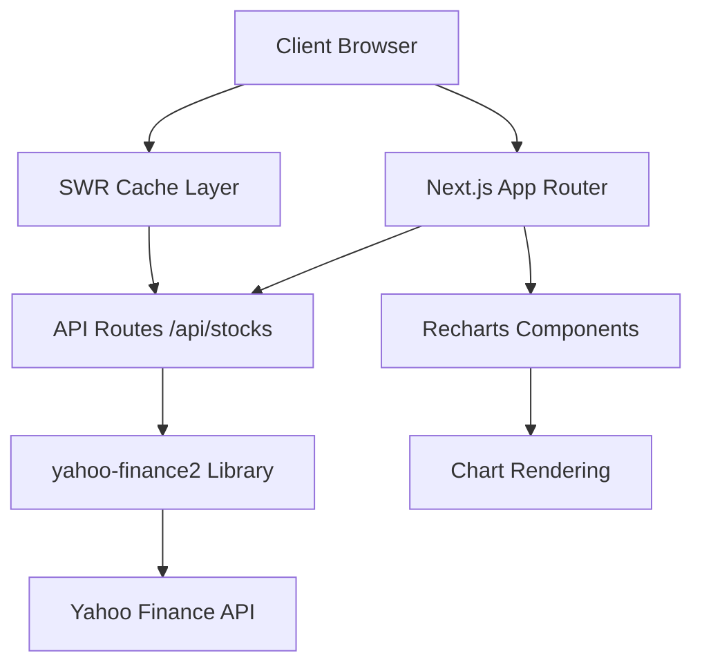

# Design Document: FluxFinance

## Overview

FluxFinance は個人投資家向けの高速株価監視ダッシュボードです。Yahoo Finance API を活用し、特定銘柄（GRRR 等）と主要指数（S&P500、日経平均）の価格情報を、モバイル・デスクトップ両対応のレスポンシブ UI で提供します。

**設計原則:**

- Simple & Fast: 証券会社アプリより高速な起動
- 最小限の情報密度: 必要な情報のみを凝縮表示
- レスポンシブ設計: スマホ・PC 両対応

## Architecture

### システム構成



### 技術スタック

**Frontend:**

- Next.js 14+ (App Router)
- TypeScript (型安全性)
- Tailwind CSS (高速スタイリング)
- SWR (データフェッチング・キャッシュ)
- Recharts (チャート描画)

**Backend:**

- Next.js API Routes (BFF 層)
- yahoo-finance2 (Yahoo Finance API クライアント)

**Testing:**

- Playwright (E2E テスト)
- Playwright MCP (テスト拡張)
- Chrome Dev Tools MCP (デバッグ・パフォーマンス分析)

**Deployment:**

- Vercel (ホスティング)

## Components and Interfaces

### Core Components

#### 1. StockCard Component

```typescript
interface StockCardProps {
  ticker: string;
  currentPrice: number;
  change: number;
  changePercent: number;
  miniChart?: ChartData[];
  onClick: () => void;
}
```

**責任:**

- 個別銘柄の価格情報表示
- 色分け表示（緑：上昇、赤：下落）
- ミニチャート表示
- 詳細モーダル開閉トリガー

#### 2. DetailChart Component

```typescript
interface DetailChartProps {
  ticker: string;
  data: ChartData[];
  timeRange: TimeRange;
  onTimeRangeChange: (range: TimeRange) => void;
}

type TimeRange = "1D" | "1W" | "1M" | "3M";
```

**責任:**

- 詳細チャート表示（ラインチャート/キャンドルスティック）
- 時間軸切り替え機能
- インタラクティブなツールチップ

#### 3. MarketTicker Component

```typescript
interface MarketTickerProps {
  items: TickerItem[];
  speed?: number;
}

interface TickerItem {
  symbol: string;
  price: number;
  change: number;
}
```

**責任:**

- 画面上部のスクロールティッカー表示
- S&P500、USD/JPY 等の主要指標表示

#### 4. Dashboard Layout

```typescript
interface DashboardProps {
  stocks: StockData[];
  lastUpdate: Date;
}
```

**責任:**

- 全体レイアウト管理
- ヘッダー（アプリ名、最終更新時刻）
- レスポンシブグリッド配置

### API Interfaces

#### Stock Data API

```typescript
// GET /api/stocks?tickers=GRRR,^GSPC,^N225,JPY=X
interface StockResponse {
  data: StockData[];
  lastUpdate: string;
  error?: string;
}

interface StockData {
  ticker: string;
  currentPrice: number;
  previousClose: number;
  change: number;
  changePercent: number;
  currency: string;
}
```

#### Historical Data API

```typescript
// GET /api/stocks/history?ticker=GRRR&range=1M
interface HistoryResponse {
  ticker: string;
  data: ChartDataPoint[];
  range: TimeRange;
}

interface ChartDataPoint {
  timestamp: number;
  open: number;
  high: number;
  low: number;
  close: number;
  volume: number;
}
```

## Data Models

### Stock Data Model

```typescript
class StockDataModel {
  ticker: string;
  currentPrice: number;
  previousClose: number;
  change: number;
  changePercent: number;
  currency: string;
  lastUpdate: Date;

  constructor(yahooData: any) {
    // yahoo-finance2のレスポンスから変換
  }

  get isPositive(): boolean {
    return this.change >= 0;
  }

  get displayColor(): "green" | "red" | "gray" {
    if (this.change > 0) return "green";
    if (this.change < 0) return "red";
    return "gray";
  }
}
```

### Chart Data Model

```typescript
class ChartDataModel {
  ticker: string;
  timeRange: TimeRange;
  dataPoints: ChartDataPoint[];

  constructor(yahooHistoryData: any, range: TimeRange) {
    // yahoo-finance2の履歴データから変換
  }

  get rechartsData(): any[] {
    // Recharts用のデータ形式に変換
    return this.dataPoints.map((point) => ({
      timestamp: point.timestamp,
      price: point.close,
      volume: point.volume,
    }));
  }
}
```

### Cache Strategy

```typescript
// SWR設定
const swrConfig = {
  refreshInterval: 30000, // 30秒間隔で自動更新
  revalidateOnFocus: true,
  revalidateOnReconnect: true,
  dedupingInterval: 10000, // 10秒間の重複リクエスト防止
};
```

## Correctness Properties

_A property is a characteristic or behavior that should hold true across all valid executions of a system-essentially, a formal statement about what the system should do. Properties serve as the bridge between human-readable specifications and machine-verifiable correctness guarantees._

### Property Analysis

<function_calls>
<invoke name="prework">
<parameter name="featureName">flux-finance
